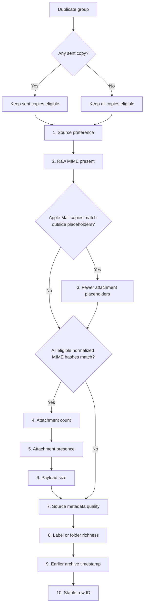

A long-running archive accumulates overlapping sources: a current Gmail sync, an old mbox export, IMAP backups, chat history. The same message often appears more than once, and duplicates start to dominate search results. `msgvault deduplicate` collapses each set of copies to a single visible survivor while keeping every source's provenance intact.

The defining principle: **deduplication hides redundant copies, it does not delete them.** One survivor stays visible. The other copies drop out of normal reads but remain on disk, and `--undo` restores them. Removing data is always a separate, explicit step that you opt into.

## How Duplicates Are Detected

Detection runs in two passes:

1. **Message-ID pass.** Messages are grouped by their RFC 822 `Message-ID` header. Each distinct ID forms one duplicate group. This is the default and is reliable for email.
2. **Content-hash pass.** With `--content-hash`, msgvault additionally groups messages by a normalized hash of their raw MIME content. This catches duplicates whose `Message-ID` headers were stripped or rewritten in transit, and messages that never had a `Message-ID` at all.

The two passes are sequential, not merged into one transitive set. A content-hash group that contains two distinct Message-ID survivors keeps both. A group that mixes a Message-ID survivor with a sent copy that has no Message-ID is skipped, so the sent-copy protection below is never bypassed.

## Which Copy Survives

Survivor selection is deterministic and explainable, and the reasoning is printed in dry-run output. It runs in two stages.

**Stage 1, sent-copy eligibility.** If any message in a group looks like a copy you sent, only sent copies are eligible to survive, and received copies drop out before tie-breaking. A message looks sent when any of these is true: it carries a Gmail `SENT` label, ingest metadata flagged it as from you, or its `From` address matches a confirmed [identity](/docs/usage/multi-account/#identities) for that account. The reasoning is that "I sent this" is harder to recover from data than "I received this," so a richer received copy is never allowed to silently win.

**Stage 2, priority list.** Among the eligible copies, msgvault prefers, in order:

1. Source type, following `--prefer` or the default order `gmail,imap,msmail,mbox,emlx,hey`.
2. Presence of the complete raw MIME payload.
3. Fewer Apple Mail attachment placeholders.
4. More attachments.
5. An attachment-presence signal when attachment counts tie.
6. A larger payload.
7. Higher source metadata quality.
8. Richer label or folder metadata.
9. Earlier archive timestamp.
10. A stable row ID, as the final tie-breaker.

Earlier rules win outright; later rules apply only when all earlier ones tie.
The attachment-count, attachment-presence, and payload-size rules apply only
when every eligible copy has raw MIME and all their normalized MIME hashes
match. A shared `Message-ID` alone cannot make those payload-completeness
signals authoritative.

The placeholder rule handles Apple Mail `.partial.emlx` copies, where an
attachment part carries an `X-Apple-Content-Length` header instead of its
bytes, next to a copy with some of those attachments restored. It applies only
in `Message-ID` groups where every eligible copy from the preferred source type
has raw MIME that parses into the same parts with the same headers and content,
except at placeholder parts. Copies that restore the same part must restore the
same bytes. Otherwise the group skips this rule.

Source metadata quality counts three independent facts, one point each: a
native Gmail, IMAP, or Microsoft Mail message ID, threading evidence, and an
RFC822 `Message-ID`.
Threading evidence means a Gmail provider conversation ID, preserved Google
Groups grouping derived from a valid exported `X-GM-THRID`, an `In-Reply-To`
header in archived metadata, or a resolved reply parent. Gmail conversation
IDs count for both historical and newly synced copies. A conversation ID equal
to its message ID earns no point: it may be a generated fallback, and archived
rows cannot distinguish that fallback from a genuine single-message thread.
Generic import conversation IDs do not count. This comparison applies even
when normalized MIME hashes differ.

The survivor inherits the union of labels from the copies it replaces, and
backfills raw MIME from a non-survivor if it was missing the original payload.



## Choosing a Scope

There are three ways to run dedup, ordered by how much they compare:

```bash
msgvault deduplicate                       # per-account, each source in isolation
msgvault deduplicate --account <name>      # one account
msgvault deduplicate --collection <name>   # cross-account, inside one collection
```

The unscoped form is the safest default. It processes each account independently and never crosses source boundaries. Cross-account dedup is higher risk, because it can collapse copies that live in independent archives whose separate provenance you may want to keep, so it requires an explicit `--collection`. To dedup across every account, name the built-in collection: `--collection All`.

This protects sent-message provenance. If Alice's Sent copy and Bob's Inbox copy share one `Message-ID`, both must survive, and per-account scope guarantees they do.

## The Safety Ladder

Every dedup-related command sits on one of five rungs (00 through 04). Rung 00 is an automatic backup; the others you climb deliberately, one explicit action at a time. msgvault never escalates from one rung to the next on its own: applying dedup never implies a local hard delete, and a local hard delete never implies a remote delete.

| Rung | Action | Command | Reversibility |
|---|---|---|---|
| 00 | Backup (automatic, SQLite-only) | runs before rungs 02 and 03 | point-in-time backup; PostgreSQL uses `pg_dump` |
| 01 | Scan | `deduplicate --dry-run` | no data touched |
| 02 | Hide | `deduplicate` | reversible with `--undo <batch-id>` |
| 03 | Local hard delete | `delete-deduped --batch <batch-id>` | irreversible locally |
| 04 | Remote delete | `delete-staged` | archived content retained; Gmail/IMAP default to Trash, `--permanent` is irreversible |

!!! tip "Deletion is never required"
    You can run `deduplicate` as many times as you like and stay on rung 02 forever. Rungs 03 and 04 only ever run when you invoke a different command.

- **Rung 00, backup.** Before `deduplicate` or `delete-deduped` modifies any row, msgvault writes a point-in-time copy of the database alongside the live file (for example `msgvault.db.dedup-backup-20260503-091500`) using SQLite `VACUUM INTO`. The copy is built under a private temporary path and moved to the advertised backup filename only after it succeeds, so cancellation cannot leave an incomplete file looking like a valid backup. Opt out with `--no-backup`. Scanning modifies nothing and triggers no backup. This automatic backup is SQLite-only; on a PostgreSQL archive `deduplicate` refuses the built-in backup (there is no `VACUUM INTO` equivalent), so snapshot the database out-of-band with `pg_dump` first, then rerun with `--no-backup`.
- **Rung 01, scan.** `deduplicate --dry-run` reports the duplicate groups it found, the proposed survivor for each, and why. Nothing is modified.
- **Rung 02, hide.** `deduplicate` applies the scan. Pruned copies are hidden from normal reads but kept on disk, and the run prints a batch ID. `--undo <batch-id>` restores them.
- **Rung 03, local hard delete.** `delete-deduped` permanently removes hidden rows from the local archive to reclaim disk. It acts on named batches via `--batch` and refuses to touch rows it did not hide; all selected batches commit as one transaction, so cancellation rolls the whole selection back. `--all-hidden` purges every hidden row and always prompts for confirmation. Undo cannot recover purged rows.
- **Rung 04, remote delete.** This rung is two parts, stage then execute, and only the staging part is dedup-specific. To stage, run `deduplicate --delete-dups-from-source-server`; it writes pending deletion manifests only when the loser and survivor share a source and have matching normalized raw MIME. A group spanning two sources or lacking content equivalence stages nothing. To execute, run `delete-staged`, the generic executor for any staged deletion manifest (not just dedup), which acts on the source server, retains archived content, and records source-deletion state. Inspect first with `delete-staged --list` and target one batch with `delete-staged <batch-id>`. Execution requires durable `[deletion] remote_enabled = true` consent in the invoking CLI config, or `MSGVAULT_ENABLE_REMOTE_DELETE=1` for one command. The same-source and content-equivalence restrictions live in the staging step, not in `delete-staged`. See [Deleting Email](/docs/usage/deletion/) for how remote deletion works.

!!! note "What \"hidden\" means"
    A hidden copy is excluded from search, the Web UI, the TUI, vector and hybrid retrieval, the API, MCP responses, exports, and stats, while still living on disk. Every read path applies the same visibility rule, so a hidden duplicate cannot leak back into results through one backend.

## A Worked Walkthrough

The recommended sequence is scan, apply, then optionally undo or hard-delete.

**1. Scan first.** See what dedup would do before it does anything:

```bash
msgvault deduplicate --collection Personal --dry-run
```

**2. Apply when the dry run looks right.** msgvault writes a backup, hides redundant copies, and prints a batch ID:

```bash
msgvault deduplicate --collection Personal
```

Batch IDs look like `dedup-20260503-091500-7-me_at_example.com-0d4cb6f1`. Note the one printed by your run; the later steps take it.

**3. Undo if you change your mind.** Still on rung 02, fully reversible:

```bash
msgvault deduplicate --undo <batch-id>
```

**4. Hard-delete locally, only when you are sure.** This is rung 03 and cannot be undone:

```bash
msgvault delete-deduped --batch <batch-id>
```

## Common Scenarios

**Clean up duplicates inside one Gmail account.** Scan, then apply, and stop on rung 02:

```bash
msgvault deduplicate --account me@example.com --dry-run
msgvault deduplicate --account me@example.com
```

**You imported the same mailbox twice and want one clean view.** Put both sources in a collection, scan it, then apply. The originals on each source server are untouched:

```bash
msgvault collection create gmail-plus-mbox --accounts me@example.com,me@example.org
msgvault deduplicate --collection gmail-plus-mbox --dry-run
msgvault deduplicate --collection gmail-plus-mbox
```

**Reclaim disk from duplicates you hid earlier.** Find the batch, then hard-delete it (rung 03):

```bash
msgvault delete-deduped --batch <batch-id>
```

**Actually remove the duplicates from the source server.** Stage during a dedup run, review the pending manifests, then execute the specific batch. Staging only covers same-source pairs with matching normalized raw MIME; cross-source or non-equivalent pairs stage nothing. `delete-staged` itself is the generic deletion executor, and execution is gated:

```bash
# Stage same-source duplicates for remote deletion during a dedup run
msgvault deduplicate --collection Personal --delete-dups-from-source-server

# Review the pending deletion manifests
msgvault delete-staged --list

# Execute one batch against the source server after durable config consent
msgvault delete-staged <batch-id>

# Or grant consent for this command only
MSGVAULT_ENABLE_REMOTE_DELETE=1 msgvault delete-staged <batch-id>
```

Starting in v0.20.0, remote deletion remains permanently opt-in. The invoking
CLI may enable it durably with `[deletion] remote_enabled = true` or for one
command with `MSGVAULT_ENABLE_REMOTE_DELETE=1`. Both mechanisms are permanent;
there is no planned automatic removal of the guardrail. A remote daemon's own
`[deletion]` section is not policy for a command invoked elsewhere. Staging,
listing, inspecting, and dry-running deletion batches remain ungated.

See [Deleting Email](/docs/usage/deletion/) for the full workflow.

## What Undo Restores

`deduplicate --undo <batch-id>` restores the rows that batch hid and cancels any pending remote-deletion manifest the batch staged that has not yet executed. Passing several `--undo` flags undoes multiple batches in order. `--undo` cannot be combined with `--account`, `--collection`, or `--dry-run`.

Undo is not full time travel. It does not:

- Reverse the label union applied to the survivor.
- Reverse raw MIME backfilled onto the survivor from a non-survivor.
- Recover rows already purged with `delete-deduped`.
- Reverse remote deletions already executed against a source.

Derived indexes catch up on their next rebuild rather than instantly.

## After a Large Local Delete

A `delete-deduped` purge changes the canonical archive, but the derived analytics and vector caches may still hold stale entries. Rebuild them if you use them:

```bash
msgvault build-cache --full-rebuild
msgvault embeddings build --full-rebuild
```

## Command Reference

See the [CLI Reference](/docs/cli-reference/#deduplicate) for the complete flag list on `deduplicate`, `delete-deduped`, `identity`, and `collection`.
